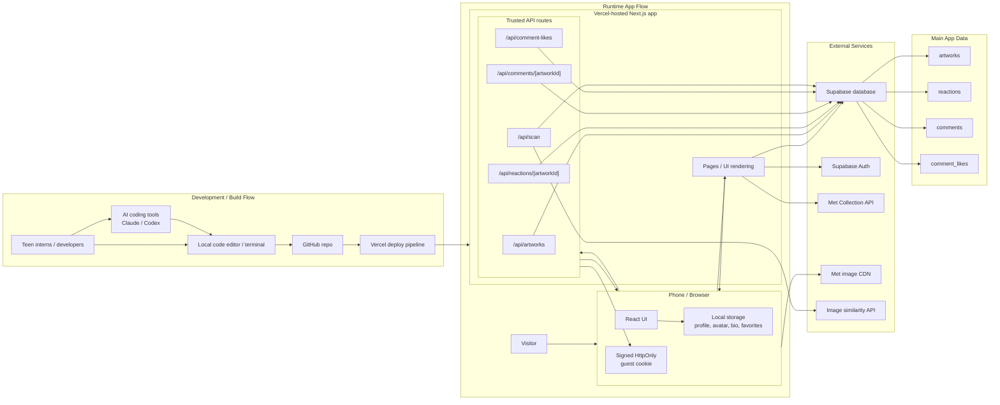

# Moji Museum System Diagram Guide

This document is for whiteboarding how the app works end to end.

The goal is not just to draw boxes, but to show:
- where the code lives
- how the app gets deployed
- what the user interacts with
- which outside services the app depends on
- where data is stored
- which parts of the system are trusted for writes

## One-Sentence Summary

Moji Museum is a web app hosted on Vercel, built from code stored in GitHub, using Supabase for app data and optional auth, The Met APIs/CDN for artwork metadata and images, and an image-similarity API for scan recognition.

## Main Boxes To Include

If the interns draw a full system diagram, these are the main boxes:

1. User / visitor
2. Phone or browser
3. Internet
4. GitHub
5. AI coding tools
   Example: Claude, Codex
6. Vercel
7. Next.js app
8. Server API routes inside the app
9. Supabase database
10. Supabase Auth
11. The Met Collection API
12. Met image CDN
13. Image similarity / recognition API
14. Browser local storage
15. Signed guest cookie

## Recommended Top-Level Layout

The easiest whiteboard layout is 3 lanes:

- Development lane
- Runtime app lane
- External services lane

Example layout:

```text
Development:
Teen interns / developers -> GitHub -> Vercel deploy
Teen interns / developers -> AI coding tools -> local code changes -> GitHub

Runtime:
User phone/browser <-> Vercel-hosted Next.js app
Browser stores local profile data
Browser sends requests to app pages and API routes

External services:
Vercel app <-> Supabase
Vercel app <-> Met Collection API
Browser/App <-> Met image CDN
Vercel app <-> image similarity API
```

## Development Diagram

This is the "how the software gets built and published" part.

### Boxes

- Teen interns / developers
- Local code editor / terminal
- AI coding assistants
- GitHub repo
- Vercel project

### Arrows

- Teen interns / developers -> local code
- AI coding assistants -> help write / review code
- Local code -> GitHub
- GitHub -> Vercel
- Vercel -> deployed website

### Notes

- GitHub stores the source code and version history
- Vercel pulls from GitHub and builds the app
- AI tools do not run the production app
- AI tools help create or edit code before it gets committed

## Runtime Diagram

This is the "what happens when a visitor uses the app" part.

### Core user flow

Boxes:
- Visitor
- Phone or laptop browser
- Vercel-hosted Next.js app

Arrows:
- Visitor taps/clicks in browser
- Browser requests pages from Vercel
- Vercel sends back HTML / JS / CSS
- Browser runs the client-side UI

### Important detail

The app is a Next.js app, so some work happens:
- in the browser
- on the server inside Vercel

That distinction matters for trust and data flow.

## Browser-Side Pieces

Include a sub-box inside the browser for:

- React UI
- local storage
- cookies

### Local storage is used for:

- profile display name
- avatar choice
- bio
- favorites

### Browser cookie is used for:

- signed guest session identity

Important:
- local storage is convenient but not trusted
- the guest cookie is trusted more because it is issued and signed by the server

## Server-Side Pieces In Vercel

Inside the Vercel / Next.js box, it helps to draw two sub-boxes:

1. App pages / UI rendering
2. API routes

### App pages

Examples:
- `/`
- `/artwork/[id]`
- `/gallery`
- `/rankings`
- `/profile`
- `/scan`

### API routes

Examples:
- `/api/artworks`
- `/api/reactions/[artworkId]`
- `/api/comments/[artworkId]`
- `/api/comment-likes`
- `/api/comment-likes/[commentId]`
- `/api/scan`

### Why split these on the diagram

Because:
- pages mostly render UI and fetch data
- API routes handle trusted writes and service-to-service calls

## Supabase Diagram

Supabase should be drawn as at least 2 boxes:

1. Supabase database
2. Supabase Auth

### Database tables worth naming

- `artworks`
- `reactions`
- `comments`
- `comment_likes`

You do not need to draw every column, but if you want extra detail:
- `artworks` stores cached artwork metadata
- `reactions` stores one reaction per guest per artwork
- `comments` stores top-level comments and replies
- `comment_likes` stores who liked which comment

### Auth

Supabase Auth is optional in the current app.

Good diagram note:
- "Optional account login"
- "Not yet the main identity system for reactions/comments"

## Guest Mode Diagram

This should be one of the clearest parts of the whiteboard.

### Boxes

- Browser
- Vercel API route
- Signed guest cookie
- Supabase

### Flow

1. Browser makes a request to a trusted API route
2. If there is no guest cookie yet, server creates a guest ID
3. Server signs it and sets it in an `HttpOnly` cookie
4. Browser stores cookie automatically
5. Later requests include the cookie
6. Server verifies the signature
7. Server uses that guest ID for writes to Supabase

### Why this matters

This prevents the browser from choosing any random `guest_id` when writing reactions or likes.

Good whiteboard label:
- "Trusted identity boundary moves to server"

## Read vs Write Paths

A very useful diagram detail is to label arrows as:
- public reads
- trusted writes

### Public reads

Examples:
- loading rankings
- loading artwork details
- loading reaction totals
- loading homepage category leaders

These can use browser-friendly Supabase reads or public APIs.

### Trusted writes

Examples:
- save reaction
- add comment
- reply to comment
- like a comment
- upsert discovered artwork after scan

These go through Vercel API routes, not directly from the browser to Supabase.

## The Met Services

There are really 3 separate "Met-related" boxes worth drawing.

### 1. The Met Collection API

What it does:
- returns artwork metadata
- title
- artist
- year
- medium
- department
- image URL

Typical flow:
- app page or server fetches artwork details

### 2. Met image CDN

What it does:
- serves artwork images

Important detail:
- browsers often load these image URLs directly
- this is separate from the metadata API

### 3. The Met / semantic image similarity service

What it does:
- takes an uploaded image
- returns visually similar artworks

Important detail:
- the browser does not call this upstream service directly
- the app sends the image to `/api/scan`
- the Vercel route forwards it with the needed secret

## Scan Flow Diagram

This is a good separate mini-diagram.

### Boxes

- User camera or uploaded photo
- Browser scan page
- `/api/scan` on Vercel
- image similarity API
- Supabase `artworks` table
- artwork detail page

### Flow

1. User takes photo or uploads image
2. Browser sends image to `/api/scan`
3. Vercel API route forwards image to similarity API
4. Similarity API returns matches
5. App displays results
6. App stores matched artwork metadata in Supabase
7. User can open artwork page and react/comment

## Profile / Identity Diagram

This is a place where interns should distinguish "real identity" from "display preferences."

### Local profile settings

Stored in browser local storage:
- display name
- avatar
- bio
- favorites

### Trusted interaction identity

Stored through:
- signed guest cookie
- server-side verification

### Optional account identity

Stored in:
- Supabase Auth

### Diagram note

The current app has 3 identity-ish layers:
- display preferences
- guest interaction identity
- optional email account login

That is slightly messy, but it is accurate.

## Secrets / Environment Variables

It can help to draw a small "Secrets" box attached to Vercel.

Include:
- `NEXT_PUBLIC_SUPABASE_URL`
- `NEXT_PUBLIC_SUPABASE_ANON_KEY`
- `SUPABASE_SERVICE_ROLE_KEY`
- `GUEST_SESSION_SECRET`
- `IMAGE_SEARCH_BYPASS_SECRET`

### Important labels

- `NEXT_PUBLIC_*` values can be used by the browser
- service role key is server-only
- guest session secret is server-only
- image bypass secret is server-only

## Trust Boundaries

This is one of the most important teaching ideas in the whole diagram.

Use dashed lines or a different color.

### Suggested trust boundaries

1. Between browser and server
   The browser is not fully trusted

2. Between server and database
   Server can perform trusted writes

3. Between app and external APIs
   External APIs are dependencies, not part of your own system

### Good annotation

- "User-controlled"
- "Server-controlled"
- "Third-party service"

## Suggested Whiteboard Version

If interns only have time for one medium-detail diagram, this is the version to draw:

```text
[Teen interns / devs]
    -> [Local coding]
    -> [AI tools: Claude / Codex]
    -> [GitHub repo]
    -> [Vercel deployment]

[User]
    -> [Phone / Browser]
    -> [Next.js app on Vercel]

Inside Vercel:
    [Pages/UI]
    [API routes]

Browser also has:
    [Local storage: profile, favorites]
    [HttpOnly guest cookie]

Vercel connects to:
    [Supabase DB]
    [Supabase Auth]
    [Met Collection API]
    [Met image CDN]
    [Image similarity API]
```

## More Detailed Whiteboard Version

If they want a richer systems diagram, include arrow labels:

- Browser -> Vercel Pages: page request
- Browser -> Vercel API routes: trusted writes
- Vercel API routes -> Supabase DB: reactions/comments/likes/artwork upserts
- Browser or Vercel -> Supabase DB: public reads
- Vercel -> Met API: artwork metadata
- Browser -> Met CDN: artwork images
- Vercel `/api/scan` -> image similarity API: photo recognition
- Vercel API routes -> browser: set signed guest cookie
- Browser -> Vercel: sends guest cookie automatically on later requests

## Questions Interns Should Be Able To Answer

If the diagram is good, they should be able to answer:

1. Where is the code stored?
   GitHub

2. Where is the app hosted?
   Vercel

3. Where is the app data stored?
   Supabase

4. Where does artwork metadata come from?
   The Met Collection API

5. Where do artwork images come from?
   Met image CDN

6. How does scan recognition work?
   Browser -> `/api/scan` -> similarity API -> results

7. What makes guest mode more trustworthy now?
   Server-issued signed guest cookie and server-side writes

8. What is stored only in the browser?
   Profile preferences and favorites

9. What is optional today?
   Account sign-in

10. What is still not fully solved?
   Display-name uniqueness, spam/rate limits, moderation, guest-to-account migration

## What Not To Miss In The Diagram

Easy-to-forget pieces:
- GitHub
- AI coding tools
- browser local storage
- signed guest cookie
- Supabase Auth as separate from database
- Met image CDN as separate from Met API
- `/api/scan` as a proxy, not just a direct external call
- the distinction between public reads and trusted writes

## Best Practice For The Whiteboard

Use different arrow styles or colors:
- black arrows: normal app requests
- blue arrows: public data reads
- red arrows: trusted writes
- green arrows: external API dependencies

And label each box as one of:
- browser/client
- your server/app
- your database
- third-party service
- developer tooling

## Mermaid Diagram


